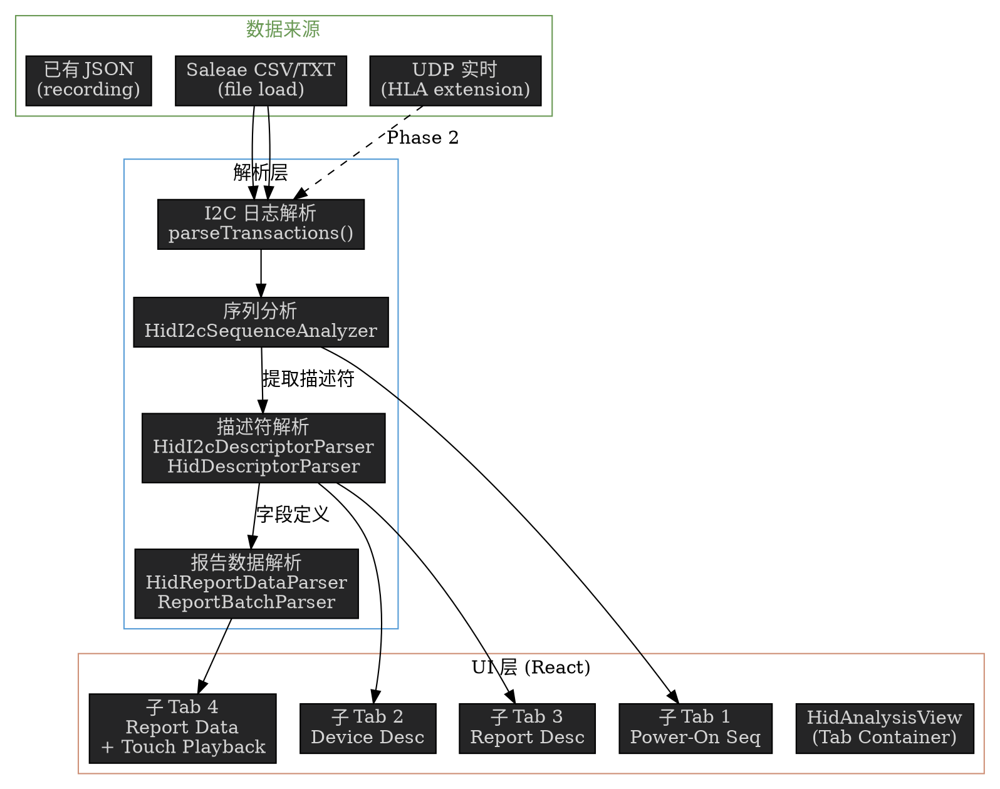

# HID I2C 分析功能集成 —— 可行性方案

**日期：** 2026-06-12  
**状态：** 待用户审阅  
**参考项目：** `Waratah/`（C# .NET 8.0 WPF 应用）

---

## 1. 概述

### 1.1 目标

在现有 Touchpad Tracker 中新增一个 **HID I2C Analysis** 主界面，其下包含 4 个子标签页：

| # | 子界面 | Waratah 对应模块 |
|---|--------|-----------------|
| 1 | Power-On Sequence（上电序列） | `HidI2cSequenceAnalyzer` |
| 2 | Device Descriptor（设备描述符） | `HidI2cDescriptorParser` |
| 3 | Report Descriptor（报告描述符） | `HidDescriptorParser` + `ReportAnalyzer` |
| 4 | Report Data Parser（报告数据解析） | `HidReportDataParser` + `ReportBatchParser` |

### 1.2 背景

Waratah 项目是一套完整的 HID over I2C 协议分析工具（C#），覆盖从原始 I2C 总线日志到触摸数据回放的全流程。当前 touchpad-tracker 项目是 TypeScript/Electron 触控轨迹可视化工具，两者处理的 I2C 数据来源相同（Saleae Logic 导出 CSV），但在协议层次上分工不同：

- **touchpad-tracker**：解析**触摸板私有协议**（0x2F 帧头 + 手指/笔包）
- **Waratah**：解析**HID over I2C 标准协议**（30 字节设备描述符 + HID 报告描述符 + 报告数据）

集成后，两个工具的功能互补，形成从底层 I2C 信号到顶层触摸轨迹的完整分析链路。

---

## 2. 当前项目架构回顾

### 2.1 技术栈

| 层面 | 技术 |
|------|------|
| 运行时 | Electron 33 + Node.js |
| UI | React 19 + TypeScript 4.5 |
| 构建 | Vite + electron-forge |
| 数据入口 | UDP（实时）+ 文件加载（CSV/TXT/JSON）|
| 渲染 | Canvas 2D（轨迹）+ React DOM（帧列表/调试）|

### 2.2 现有视图

| 视图 | 功能 |
|------|------|
| Live（TrajectoryView）| UDP 实时轨迹渲染 |
| Playback（PlaybackView）| 文件回放轨迹渲染 |
| FrameList（FrameListView）| 帧数据列表 |
| Debug（DebugView）| 笔包 16 通道调试数据 |

### 2.3 可复用的基础能力

| 能力 | 位置 | 复用方式 |
|------|------|---------|
| Saleae CSV 解析 | `parseSaleaeTXT.ts` | 直接复用 I2C 地址过滤 + 字节提取 |
| I2C 地址配置 | `App.tsx` I2C Addr 输入框 | 复用同一配置 |
| UDP 实时接收 | `main.ts` | 新增消息路由写 HID 缓存 |
| JSON 录制/回放 | `useRecorder.ts` / `usePlayer.ts` | HID 分析结果可复用录制框架 |
| Canvas 触摸回放 | `PlaybackView.tsx` | 适配 HID 触摸帧数据 |
| 深色主题 UI | 全部组件 | 复用颜色常量和行高规范 |

---

## 3. Waratah 四个模块详解

### 3.1 模块一：Power-On Sequence（上电序列分析）

**Waratah 源码：** `HidParser/HidI2cSequenceAnalyzer.cs`（约 600 行）

**功能：**
1. 从 I2C 总线日志中过滤目标设备地址的所有读写事务
2. 按时间线重构 HID over I2C 协议交互序列
3. 自动识别：
   - **HID Descriptor 读取**：主机向 `HidDescRegister` 写入地址 → 从机返回 30 字节设备描述符
   - **Report Descriptor 读取**：主机向 `ReportDescRegister` 写入地址 → 从机返回 N 字节报告描述符
   - **命令交互**：SET_POWER (ON/OFF)、RESET、GET/SET_REPORT、GET/SET_IDLE、GET/SET_PROTOCOL
   - **输入报告**：从机自发推送的报告数据（带 2 字节长度前缀）
4. 自动提取报告描述符字节 → 传递给 Report Descriptor 和 Report Data 模块
5. 生成 Markdown/HTML 分析报告

**支持的输入格式：**
- Saleae CSV：`Time [s],Packet ID,Address,Data,Read/Write,ACK/NAK`
- 方括号时间戳：`[123.456] W addr: 0xNN data`
- 简单 W/R 格式：`W: 0xNN 0xNN...`
- 裸十六进制行

**输出：**
```markdown
# HID I2C Power-On Sequence Analysis

## Device Info
| Field | Value |
|-------|-------|
| VID   | 0x0416 |
| PID   | 0x038F |
| BCD Version | 1.00 |

## Sequence Events (timeline table)
| Order | Timestamp | Direction | Event | Description |
|-------|-----------|-----------|-------|-------------|
| 1     | +0.0ms    | W→S       | RST   | Reset command |
| 2     | +5.2ms    | W→S       | GHD   | Get HID Descriptor |
| 3     | +5.8ms    | S→W       | HDR   | HID Descriptor response (30 bytes) |
| 4     | +8.1ms    | W→S       | GRD   | Get Report Descriptor |
...

## Protocol Commands (decoded report payloads)
...
```

---

### 3.2 模块二：Device Descriptor（设备描述符）

**Waratah 源码：** `HidParser/HidI2cDescriptorParser.cs`（约 300 行）

**功能：**
1. 解析 30 字节 HID over I2C 设备描述符（Microsoft 规范）
2. 验证字段合法性（长度=30、BCD 版本、寄存器地址非零等）
3. 生成可视化注册器映射表

**描述符字段结构：**

| 偏移 | 大小 | 字段 | 说明 |
|------|------|------|------|
| 0x00 | 2 | `wHIDDescLength` | 描述符自身长度 |
| 0x02 | 2 | `bcdVersion` | 协议版本（通常 0x0100）|
| 0x04 | 2 | `wReportDescLength` | 报告描述符长度 |
| 0x06 | 2 | `wReportDescRegister` | 报告描述符寄存器地址 |
| 0x08 | 2 | `wInputRegister` | 输入报告寄存器地址 |
| 0x0A | 2 | `wMaxInputLength` | 最大输入长度 |
| 0x0C | 2 | `wOutputRegister` | 输出报告寄存器地址 |
| 0x0E | 2 | `wMaxOutputLength` | 最大输出长度 |
| 0x10 | 2 | `wCommandRegister` | 命令寄存器地址 |
| 0x12 | 2 | `wDataRegister` | 数据寄存器地址 |
| 0x14 | 2 | `wVendorID` | USB VID |
| 0x16 | 2 | `wProductID` | USB PID |
| 0x18 | 2 | `wVersionID` | 固件版本 |
| 0x1A | 4 | `Reserved` | 保留 |

**输出：** 描述符字段表格 + 6 寄存器映射表 + 验证结果

---

### 3.3 模块三：Report Descriptor（报告描述符）

**Waratah 源码：** `HidParser/HidDescriptorParser.cs`（约 300 行）+ `HidSpecification/HidUsageTableDefinitions.cs`（约 2000 行）+ `HidParser/ReportAnalyzer.cs`（约 400 行）

**功能：**
1. 将 HID Report Descriptor 字节码**逐项解析**为结构化条目（Main/Global/Local 三类）
2. 维护全局状态机（UsagePage、LogicalRange、ReportSize/Count/Id、Push/Pop 栈）
3. 分析解析后的条目 → 输出报告字段定义（字段名、位宽、位偏移、逻辑范围、标识位）
4. 生成 Markdown 摘要（字节/位布局表格）
5. 支持 `.wara` (TOML) ↔ 描述符字节双向转换
6. 支持描述符十六进制 ↔ 注释展示格式

**HID 条目解析示例：**
```
输入字节： 05 01 09 02 A1 01 85 01 15 00 26 FF 0F 75 08 95 06 81 02 C0
解析结果：
  UsagePage (Generic Desktop)     ← Global item
  Usage (Mouse)                    ← Local item
  Collection (Application)         ← Main item
  ReportID (1)                     ← Global item
  LogicalMinimum (0)               ← Global item
  LogicalMaximum (4095)            ← Global item
  ReportSize (8)                   ← Global item
  ReportCount (6)                  ← Global item
  Input (Data,Var,Abs)             ← Main item
  EndCollection                    ← Main item
```

**报告字段分析输出：**
```
Report ID 1 (Input):
Byte 0.0  : Contact Identifier    size=8  [0 ~ 127]
Byte 1.0  : Tip Switch            size=1  [0 ~ 1]
Byte 1.1  : In Range              size=1  [0 ~ 1]
Byte 1.2  : Confidence            size=1  [0 ~ 1]
Byte 1.3  : Tip Pressure          size=5  [0 ~ 63]
Byte 2.0  : X                     size=12 [0 ~ 4095]
Byte 4.4  : Y                     size=12 [0 ~ 4095]
...
```

---

### 3.4 模块四：Report Data Parser（报告数据解析）

**Waratah 源码：** `HidParser/HidReportDataParser.cs`（约 250 行）+ `HidParser/ReportBatchParser.cs`（约 300 行）

**功能：**
1. 输入原始报告数据字节 + 字段定义 → 逐字段解码值
2. 支持批量解析（多帧）→ 按 Report ID 分组
3. 输出 Markdown 表格（字段名、位偏移、大小、原始值、解析值）
4. 提取**触摸帧**（ScanTime、ContactCount、X、Y、Pressure、Width、Height 等）
5. 触摸帧可用 Canvas 动画回放

**解析示例：**
```
原始字节：01 01 FF 0F A0 0F 10  ...
          └─ Report ID = 1

输入 Report ID=1 的字段定义：
  Contact Identifier : bits[0:8]   = 0x01 → 1
  Tip Switch         : bit[8]      = 0x01 → 1 (down)
  In Range           : bit[9]      = 0x01 → 1
  Confidence         : bit[10]     = 0x01 → 1
  Tip Pressure       : bits[11:16] = 0x1F → 31
  X                  : bits[16:28] = 0x0FFF → 4095
  Y                  : bits[28:40] = 0x0FA0 → 4000
  ...
```

**依赖库（Waratah C#）：**
- `Markdig` — Markdown 渲染为 HTML
- `Tomlyn` — TOML 解析（.wara 文件）
- `Newtonsoft.Json` — JSON 反序列化（HID Usage Table 嵌入数据）

---

## 4. 集成架构方案

### 4.1 整体架构

新增 `HID I2C Analysis` 作为第 5 个主视图模式，嵌入现有 App.tsx 的导航体系。

```
┌─ App.tsx ─────────────────────────────────────────────────┐
│  [Live] [Playback] [Frame List] [Debug] [HID Analysis]    │ ← 新增按钮
│  ┌─ HidAnalysisView ────────────────────────────────────┐ │
│  │  [Power-On Seq] [Device Desc] [Report Desc] [Data]   │ │ ← 子标签
│  │  ┌──────────────────────────────────────────────────┐ │ │
│  │  │  Tab content (text input + results)              │ │ │
│  │  └──────────────────────────────────────────────────┘ │ │
│  └───────────────────────────────────────────────────────┘ │
└────────────────────────────────────────────────────────────┘
```

### 4.2 ViewMode 扩展

```typescript
type ViewMode = 'live' | 'playback' | 'frameList' | 'debug' | 'hidAnalysis';
```

### 4.3 文件结构

```
touchpad-tracker/src/
├── hid/                              # NEW: HID 分析模块
│   ├── types.ts                      # HID 专用类型
│   ├── HidI2cDescriptorParser.ts     # 设备描述符解析
│   ├── HidDescriptorParser.ts        # 报告描述符解析
│   ├── HidI2cSequenceAnalyzer.ts     # 上电序列分析
│   ├── ReportAnalyzer.ts             # 字段分析
│   ├── HidReportDataParser.ts        # 报告数据解析
│   ├── ReportBatchParser.ts          # 批量帧解析
│   ├── HidUsagePages.ts              # HID 用法表
│   └── HidConstants.ts               # 协议常量
├── components/
│   └── HidAnalysisView.tsx           # NEW: HID 分析主容器 + 4 子标签
├── App.tsx                           # MODIFY: 添加 hidAnalysis 模式和导航按钮
└── main.ts                           # MODIFY: 可选，HID 事件缓存（如需要实时）
```

---

## 5. 代码搬移分析

### 5.1 搬移策略：C# → TypeScript

Waratah 核心逻辑适合搬移，原因：

| 特征 | 评估 |
|------|------|
| 纯算法逻辑（状态机、位运算、解析） | ✅ 直接逐行翻译 |
| 无 .NET 特定依赖（除 Markdig/Tomlyn） | ✅ JS 有等效库 |
| 类型系统相似（C# class → TS interface/class） | ✅ 结构可一一对应 |
| 无平台特定代码（除 WPF UI） | ✅ UI 层用 React 重写 |
| HID Usage Table 数据（嵌入式 JSON） | ✅ 可提取为独立 JSON 文件 |

### 5.2 逐模块搬移量估算

| Waratah 模块 | C# 行数 | 搬移难度 | TS 预估行数 | 关键风险 |
|-------------|----------|---------|------------|---------|
| `HidConstants` | ~80 | 低 | ~80 | 无，纯常量定义 |
| `HidUsagePages` | ~300 | 低 | ~400 | 需提取 JSON 用法表 |
| `HidI2cDescriptorParser` | ~250 | 低 | ~280 | 无，纯字节解析 |
| `HidDescriptorParser` | ~250 | **中** | ~300 | 长条目（0xFE）处理 |
| `ReportAnalyzer` | ~350 | **中** | ~400 | Push/Pop 栈状态管理 |
| `HidI2cSequenceAnalyzer` | ~550 | **高** | ~650 | 多格式输入解析 + 状态机 |
| `HidReportDataParser` | ~200 | 低-中 | ~250 | 位提取（LSB first）|
| `ReportBatchParser` | ~250 | 中 | ~300 | 触摸帧提取逻辑 |
| **小计（核心解析）** | **~2230** | | **~2660** | |

| Waratah 辅助模块 | C# 行数 | 搬移策略 |
|-----------------|----------|---------|
| `HidDescriptorFormatter` | ~100 | 搬移 |
| `WaraGenerator` / `WaraToDescriptorGenerator` | ~800 | **Phase 2 或砍掉** — 依赖 TOML，属高级功能 |
| `HidUnit` / `HidUnitDefinitions` | ~300 | **砍掉** — HID Unit 判定为 YAGNI |
| `HidSpecificationException` | ~30 | 用标准 TS Error 替代 |
| Markdig → `marked` 或 `markdown-it` | | npm 依赖，零代码搬移 |
| Tomlyn → `toml` npm 包 | | 仅在 Phase 2 需要 |

### 5.3 可砍掉的部分（YAGNI）

| 功能 | 理由 |
|------|------|
| `.wara` TOML 生成/解析 | Waratah 的高级 IDE 功能，对分析工具非必需 |
| C++ 头文件生成 (CppGenerator) | Waratah 的代码生成功能，非分析工具需求 |
| HID Unit 物理单位系统 | 触摸板分析不需要厘米/克/秒等单位 |
| Push/Pop 深度不支持（部分简化） | 绝大多数触摸板描述符不使用 Push/Pop |

### 5.4 库依赖变更

| Waratah (C#) | 替换为 (TS/JS) | 用途 |
|-------------|---------------|------|
| `Markdig` | `marked`（~35kB gzip）| Markdown → HTML |
| `Tomlyn` | 暂不需要（Phase 2 用 `toml`）| .wara 解析 |
| `Newtonsoft.Json` | `JSON.parse` (内置) | HID Usage Table 加载 |
| WebBrowser 控件 | React `dangerouslySetInnerHTML` + CSS | HTML 结果展示 |
| WPF Canvas | Canvas 2D（已有）| 触摸回放 |

---

## 6. UI 设计方案

### 6.1 主容器布局

```
┌───────────────────────────────────────────────────────────────┐
│ Toolbar: [I2C Addr: 0x2C] [Load Saleae CSV] [Parse] [Clear]  │
├───────────────────────────────────────────────────────────────┤
│ [Power-On Seq] [Device Desc] [Report Desc] [Report Data]      │ ← 子标签
├───────────────────────────────────────────────────────────────┤
│ ┌── Input Area ────────────────────────────────────────────┐  │
│ │  (LineNumberedTextBox for large raw data — 可折叠)       │  │
│ │  粘贴 Saleae 导出 CSV 或十六进制描述符                     │  │
│ └──────────────────────────────────────────────────────────┘  │
│ ┌── Result Area ───────────────────────────────────────────┐  │
│ │  (HTML render — dangerouslySetInnerHTML, 深色主题 CSS)   │  │
│ │  分析结果以格式化表格展示                                  │  │
│ └──────────────────────────────────────────────────────────┘  │
└───────────────────────────────────────────────────────────────┘
```

### 6.2 各子标签页 UI

#### Tab 1: Power-On Sequence
- **输入**：大的文本区 + I2C 地址/ HID Desc 寄存器配置
- **输出**：时间线事件表 + 提取的描述符预览
- **快捷操作**：`[Auto-fill Report Desc]` 按钮 → 将提取的报告描述符填入 Tab 3

#### Tab 2: Device Descriptor
- **输入**：30 字节十六进制（30 pairs） + "加载示例" 预设按钮
- **输出**：字段表格 + 寄存器映射表 + 验证结果
- **说明**：数据可来自 Tab 1 分析结果

#### Tab 3: Report Descriptor
- **输入**：十六进制描述符字节 + 格式切换（纯十六进制 / 注释格式）
- **输出**：条目列表 + 字段布局表（位偏移、大小、用法、范围）
- **说明**：可加载 Tab 1 提取的描述符，也可手动粘贴

#### Tab 4: Report Data Parser
- **输入 A**：报告描述符（通常来自 Tab 1 或 Tab 3）
- **输入 B**：原始报告数据字节（多行）
- **输入选项**：`[ ] 数据含 2 字节长度前缀` `I2C 地址过滤`
- **输出 A（表格视图）**：按 Report ID 分组的字段值表格
- **输出 B（触摸回放）**：复刻 TouchPlaybackControl 的 Canvas 动画

### 6.3 数据传递

模块间自动传递数据（减少用户复制粘贴）：

```
Tab 1 (Sequence) ──提取──→ _extractedDescriptor (30B)  → Tab 2 预填
Tab 1 (Sequence) ──提取──→ _extractedReportDesc (N B) → Tab 3 预填
Tab 3 (Report Desc) ──分析→ _reportFields              → Tab 4 预填
```

---

## 7. 数据流



---

## 8. 风险与对策

| 风险 | 概率 | 影响 | 对策 |
|------|------|------|------|
| HID Usage Table JSON 太大（~200KB） | 中 | 中 | 做懒加载：仅在使用页面查找时加载；或压缩后用 Web Worker 解析 |
| Waratah C# 逻辑搬移遗漏边界 case | 中 | 高 | 用 Saleae 导出的真实 CSV 做回归测试；与 Waratah C# 输出对照 |
| ReportBatchParser 触摸帧提取与现有 PlaybackView 不兼容 | 低 | 中 | 做适配层：将 `TouchFrame` 转为现有 `FingerFrame` 格式 |
| 类型检查开销（2000+ 行新 TS，手写类型） | 低 | 低 | `tsc --noEmit --skipLibCheck` 持续验证 |
| 渲染性能（大 CSV → 大量分析结果） | 低 | 低 | 分析在 main process 做（Node.js），结果通过 IPC 传 React |
| 用户混淆两个 "Debug" 概念 | 中 | 低 | 命名为 "HID Analysis" 而非 "Debug"；帮助弹窗补充说明 |

---

## 9. 工作量估算

### Phase 1: 核心功能（建议首次交付）

| # | 任务 | 预估工时 |
|---|------|---------|
| 1 | 搬移 `HidConstants.ts` + `HidUsagePages.ts` | 2h |
| 2 | 搬移 `HidI2cDescriptorParser.ts` + types | 3h |
| 3 | 搬移 `HidDescriptorParser.ts` | 4h |
| 4 | 搬移 `ReportAnalyzer.ts` | 4h |
| 5 | 搬移 `HidI2cSequenceAnalyzer.ts` | 6h |
| 6 | 搬移 `HidReportDataParser.ts` + `ReportBatchParser.ts` | 5h |
| 7 | 集成 Saleae CSV 数据源（复用 `parseSaleaeTXT.ts`） | 3h |
| 8 | 创建 `HidAnalysisView.tsx`（主容器 + 4 子标签） | 5h |
| 9 | 创建 4 个子标签页 UI（输入 + 结果展示） | 8h |
| 10 | 集成到 `App.tsx`（导航按钮 + viewMode + prevViewModeRef） | 2h |
| 11 | 模块间数据传递（描述符自动预填） | 2h |
| 12 | 写测试数据 + 端到端验证 | 4h |
| 13 | 文档更新（README + help 弹窗） | 2h |
| **合计** | | **~50h** |

### Phase 2: 增强功能（后续迭代）

| # | 功能 | 说明 |
|---|------|------|
| - | UDP 实时 HID 数据支持 | 实时接收 HID 报告并实时解析 |
| - | `.wara` TOML 支持 | 搬移 `WaraGenerator` / `WaraToDescriptorGenerator` |
| - | 多格式输入智能识别 | 自动检测 Saleae CSV / 裸十六进制 / 方括号格式 |
| - | HID 触摸 Canvas 回放 | 与现有 TouchPlaybackControl 对齐的 Canvas 动画 |
| - | 导出分析结果为 PDF/HTML | 持久化分析报告 |

---

## 10. 建议

### 推荐方案：Phase 1 全部落地，Phase 2 按需迭代

**理由：**

1. **技术可行**：Waratah 核心逻辑纯算法，C# → TypeScript 搬移无硬伤
2. **架构契合**：两项目共用 Saleae 数据源、I2C 地址配置、深色主题 UI 模式
3. **低耦合**：新增 `src/hid/` 模块独立于现有代码，不破坏现有功能
4. **用户价值高**：从"只看到触摸轨迹"升级到"理解 HID 协议全貌"——从底层 I2C 事务到顶层触摸坐标的端到端分析

### 与现有功能的自然衔接

```
用户工作流（新）：
  Saleae 导出的 CSV
    │
    ├─→ Load 到 Live/Playback → 触摸轨迹 + 笔轨迹（已有）
    ├─→ Load 到 Debug View → 16 通道调试数据（刚完成）
    └─→ Load 到 HID Analysis → 协议层分析（本次新增）
         ├── Power-On Sequence：理解上电握手过程
         ├── Device Descriptor：确认设备 VID/PID/寄存器布局
         ├── Report Descriptor：理解报告格式和字段语义
         └── Report Data Parser：验证报告数据解析是否正确
```

### 与其他方案的对比

| 方案 | 优势 | 劣势 |
|------|------|------|
| **A. 搬移 C# 到 TS（推荐）** | 一个工具覆盖全流程；离线可用；与现有功能无缝集成 | 搬移工作量约 50h |
| B. 嵌入 Waratah 命令行 | 零搬移 | 需要 Windows + .NET；跨平台丧失；用户体验割裂 |
| C. 用 WebAssembly 编译 C# | 保留原始逻辑 | Blazor WASM 体积巨大（~5MB+）；不支持 Node.js 集成 |

---

## 11. 下一步

如本方案获得批准，将依次执行：

1. **Spec 定稿**：根据您的反馈修订本文档
2. **实施计划**：使用 `writing-plans` skill 产出详细实施计划
3. **Phase 1 开发**：按第 9 节任务清单逐项编码
4. **验证**：使用 `debug-data/` 目录下已有 Saleae CSV 文件做回归测试
5. **Commit + Push**

---

*本报告基于对 Waratah 项目 100+ 源文件的完整分析。分析覆盖了 HidParser（11 文件）、HidEngine（30+ 文件）、HidSpecification（9 文件）、WaratahUI（10+ 文件）四个项目中的所有核心代码。*
